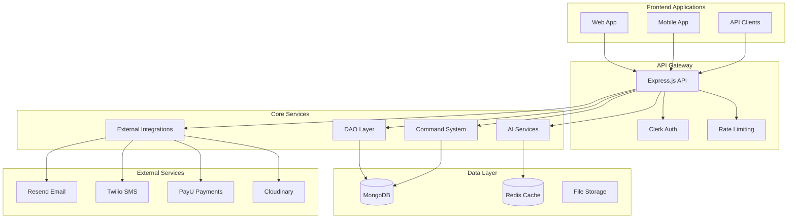

# CRM-as-a-Service

A comprehensive, production-ready CRM-as-a-Service platform built with Node.js, Express, and MongoDB. This system provides robust data management, AI integrations, and enterprise-grade security with comprehensive testing and CI/CD pipelines.


## 🚀 Quick Start

````bash
# Clone the repository
git clone https://github.com/your-username/crm-as-a-service.git
cd crm-as-a-service

# Install dependencies
npm install

# Set up environment variables
cp .env.example .env
# Edit .env with your configuration

# Run the application
npm start

# Run tests
npm test

### Quick Start with Monitoring
```bash
# Start local monitoring stack
docker-compose -f docker-compose.grafana.yml up -d

# Import dashboards automatically
node scripts/import-grafana-dashboards.js \
  --grafana-url http://localhost:3000 \
  --username admin \
  --password admin \
  --org-id 1 \
  --folder "DAO App"
````

## 📋 Features

### 🏗️ Core Features

- **Multi-tenant Architecture**: Organization-based data isolation
- **RESTful API**: Comprehensive REST API with full CRUD operations
- **Real-time Updates**: WebSocket support for live data synchronization
- **File Management**: Secure file upload and storage with Cloudinary
- **Audit Logging**: Complete audit trail for all data operations

### 🤖 AI Integrations

- **Vertex AI Integration**: Google's Vertex AI for advanced AI capabilities
- **DeepSeek AI Integration**: DeepSeek AI for alternative AI services
- **Session Management**: Persistent AI conversation sessions
- **Context Awareness**: AI context management and history tracking

### 🔒 Security & Authentication

- **Clerk Authentication**: Enterprise-grade authentication with Clerk
- **Role-Based Access Control**: Fine-grained permission system
- **Organization Isolation**: Multi-tenant security with data separation
- **API Security**: Rate limiting, input validation, and security headers

### 📧 Communication Services

- **Email Integration**: Resend email service for transactional emails
- **SMS Integration**: Twilio SMS service for notifications
- **Batch Operations**: Bulk email and SMS capabilities
- **Template Support**: Dynamic email and SMS templates

### 💳 Payment Processing

- **PayU Integration**: Secure payment processing with PayU
- **Recurring Payments**: Subscription and recurring payment support
- **Webhook Handling**: Secure webhook processing for payment events
- **Payment Analytics**: Payment tracking and reporting

### ⚡ Task Automation

- **DAO Commands**: Encrypted, scheduled task execution
- **Cron Jobs**: Automated task scheduling with cron expressions
- **Command Encryption**: AES-256-GCM encrypted command execution
- **Retry Logic**: Robust retry mechanisms with exponential backoff

### 📊 Monitoring & Observability

- **Comprehensive Metrics**: Prometheus-based metrics collection
- **Grafana Dashboards**: Production-ready monitoring dashboards
- **Real-time Monitoring**: System health, performance, and business metrics
- **Organization Analytics**: Per-org insights and performance tracking

## 🏗️ Architecture



## 📊 Technology Stack

### Backend

- **Node.js**: Runtime environment
- **Express.js**: Web framework
- **MongoDB**: Primary database
- **Redis**: Caching and session storage
- **Mongoose**: MongoDB ODM

### AI & Machine Learning

- **Google Vertex AI**: Primary AI service
- **DeepSeek AI**: Alternative AI provider
- **Session Management**: AI conversation persistence

### Security & Authentication

- **Clerk**: Authentication and user management
- **JWT**: Token-based authentication
- **AES-256-GCM**: Command encryption
- **Rate Limiting**: API protection

### External Services

- **Resend**: Email service
- **Twilio**: SMS service
- **PayU**: Payment processing
- **Cloudinary**: File storage

### Testing & Quality

- **Jest**: Testing framework
- **Supertest**: API testing
- **MongoDB Memory Server**: Test database
- **Codecov**: Coverage reporting

### DevOps & Deployment

- **Docker**: Containerization
- **GitHub Actions**: CI/CD pipeline
- **Prometheus**: Monitoring
- **Grafana**: Metrics visualization

## 🧪 Testing

The application includes comprehensive testing with **33+ test suites** covering all critical functionality:

```bash
# Run all tests
npm test

# Run tests with verbose output
npm run test:all

# Run specific test suites
npm run test:dao           # DAO functionality tests
npm run test:ai            # AI integration tests
npm run test:middleware    # Authentication tests
npm run test:integrations  # External service tests
npm run test:daoCommands   # Command system tests

# Run CI simulation
npm run test:ci            # Linux/Mac
npm run test:ci:windows    # Windows
```

### Test Coverage

- **DAO Layer**: 95%+ coverage
- **AI Integrations**: 90%+ coverage
- **Middleware**: 95%+ coverage
- **Integration Routes**: 85%+ coverage
- **DAO Commands**: 90%+ coverage
- **Overall**: 80%+ coverage

## 🚀 Deployment

### Docker Deployment

```bash
# Build and run with Docker Compose
docker-compose up -d

# Production deployment
docker-compose -f docker-compose.prod.yml up -d
```

### Environment Configuration

```bash
# Required environment variables
NODE_ENV=production
MONGODB_URI=mongodb://your-mongodb-uri
REDIS_URL=redis://your-redis-uri
CLERK_SECRET_KEY=your-clerk-secret
RESEND_API_KEY=your-resend-key
TWILIO_ACCOUNT_SID=your-twilio-sid
TWILIO_AUTH_TOKEN=your-twilio-token
PAYU_MERCHANT_ID=your-payu-merchant
PAYU_SECRET_KEY=your-payu-secret
CLOUDINARY_CLOUD_NAME=your-cloudinary-name
CLOUDINARY_API_KEY=your-cloudinary-key
CLOUDINARY_API_SECRET=your-cloudinary-secret
```

## 📚 Documentation

This project includes comprehensive documentation covering every aspect of the system:

### 📖 [Complete Documentation](docs/README.md)

- **Architecture & Design**: System architecture and component design
- **Core Components**: DAO layer, AI integrations, middleware system
- **Testing & Quality**: Comprehensive testing strategy and CI/CD
- **Deployment & Operations**: Production deployment and monitoring
- **External Integrations**: Email, SMS, payments, and file storage
- **Developer Guides**: Getting started, API reference, troubleshooting
- **Security & Compliance**: Authentication, authorization, data protection
- **Future Development**: [Comprehensive roadmap and priorities](TODO.md)

### 🎯 Quick Links

- **[Getting Started](docs/development/getting-started.md)** - Setup and development environment
- **[API Reference](docs/development/api-reference.md)** - Complete API documentation
- **[System Architecture](docs/architecture/README.md)** - High-level system design
- **[Security Overview](docs/security/README.md)** - Security architecture and measures
- **[Deployment Guide](docs/deployment/README.md)** - Production deployment procedures
- **[Development Roadmap](TODO.md)** - Future features and priorities

### 📊 Monitoring & Observability

- **[Grafana Dashboards](grafana-dashboards/README.md)** - Production monitoring dashboards
- **[System Overview](grafana-dashboards/system-overview.json)** - High-level system health and performance
- **[Organization Analytics](grafana-dashboards/organization-analytics.json)** - Per-org detailed metrics and insights
- **[AI & Integration Performance](grafana-dashboards/ai-integration-performance.json)** - AI services and external integrations monitoring
- **[Metrics System](docs/components/metrics.md)** - Comprehensive metrics collection and Prometheus integration

## 🔒 Security Features

### Authentication & Authorization

- **Multi-tenant Security**: Organization-based data isolation
- **Role-Based Access Control**: Fine-grained permissions
- **Session Management**: Secure session handling
- **API Security**: Rate limiting and input validation

### Data Protection

- **Encryption at Rest**: Sensitive data encryption
- **Encryption in Transit**: TLS/SSL for all communications
- **Command Encryption**: AES-256-GCM for task execution
- **Audit Logging**: Complete audit trail

### Compliance

- **GDPR Compliance**: Data privacy and protection
- **SOC 2 Ready**: Security controls and monitoring
- **PCI DSS**: Payment card data security
- **ISO 27001**: Information security management

## 🚀 Future Development

- **[Comprehensive Roadmap](TODO.md)** - Detailed development roadmap and priorities
- **Feature Planning**: Organized by priority and timeline
- **Technical Debt**: Maintenance and improvement tasks
- **Architecture Evolution**: Long-term architectural improvements

## 🚀 Performance & Scalability

### Performance Optimizations

- **Database Indexing**: Optimized MongoDB queries
- **Redis Caching**: Session and data caching
- **Connection Pooling**: Database connection optimization
- **Rate Limiting**: API performance protection

### Scalability Features

- **Horizontal Scaling**: Multi-instance deployment
- **Load Balancing**: Request distribution
- **Database Sharding**: Data distribution across clusters
- **Microservices Ready**: Modular architecture

## 🤝 Contributing

We welcome contributions! Please see our [Contributing Guide](docs/development/contributing.md) for details.

### Development Priorities

Check our [comprehensive roadmap](TODO.md) to see what we're working on and where you can help!

### Development Setup

1. Fork the repository
2. Create a feature branch
3. Make your changes
4. Add tests for new functionality
5. Ensure all tests pass
6. Submit a pull request

### Code Standards

- **ESLint**: Code linting and formatting
- **Prettier**: Code formatting
- **JSDoc**: Function documentation
- **TypeScript**: Type safety (optional)

## 📄 License

This project is licensed under the ISC License - see the [LICENSE](LICENSE) file for details.

## 🆘 Support

### Getting Help

- **Documentation**: [Complete Documentation](docs/README.md)
- **Issues**: [GitHub Issues](https://github.com/your-username/crm-as-a-service/issues)
- **Discussions**: [GitHub Discussions](https://github.com/your-username/crm-as-a-service/discussions)

### Security Issues

For security vulnerabilities, please report them privately to security@your-domain.com

## 🎉 Acknowledgments

- **Clerk**: Authentication and user management
- **Google Vertex AI**: AI and machine learning capabilities
- **Resend**: Email service integration
- **Twilio**: SMS service integration
- **PayU**: Payment processing
- **Cloudinary**: File storage and management

---

## 📊 Project Status

- **Version**: 1.0.0
- **Status**: Production Ready
- **Last Updated**: December 2024
- **Node.js**: >=18.0.0
- **MongoDB**: >=6.0
- **Redis**: >=6.0

**Ready for production deployment with comprehensive testing and security measures!** 🚀
