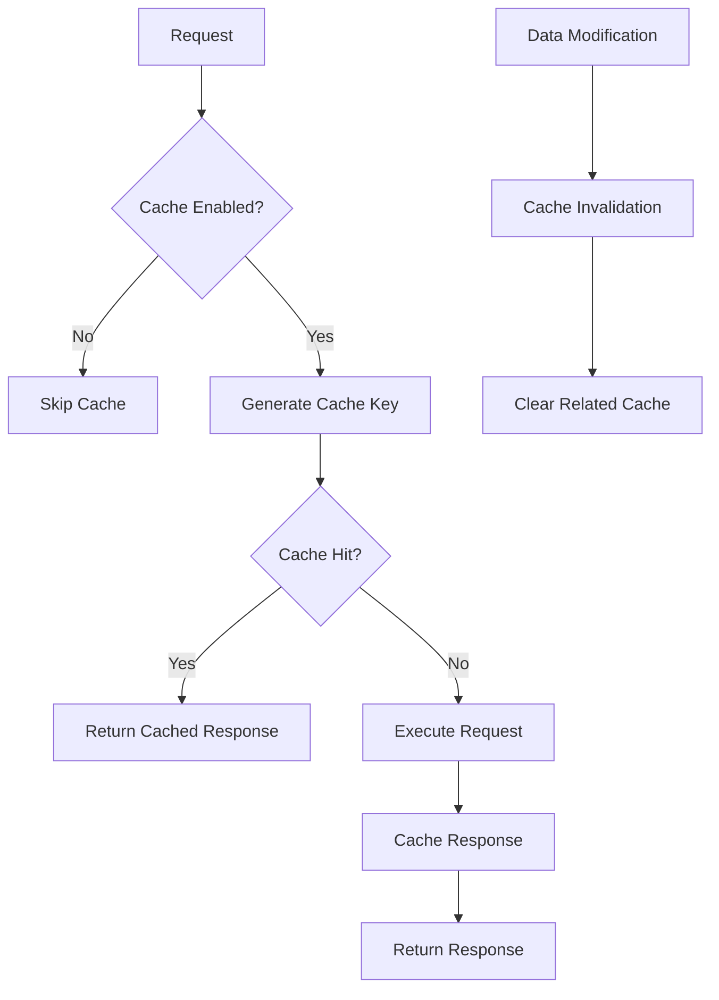

# Caching System Documentation

## Overview

The DAO application implements a sophisticated in-memory caching system designed to dramatically improve performance for frequently accessed data while maintaining data consistency through intelligent cache invalidation.

## Architecture

### Core Components

1. **Cache Service** (`services/cacheService.js`) - Core caching engine
2. **Cache Middleware** (`middlewares/cacheMiddleware.js`) - Request/response caching
3. **Cache Metrics Service** (`services/cacheMetricsService.js`) - Prometheus integration
4. **Cache Configuration** (`config/cacheConfig.js`) - Environment-based settings

### Cache Types

| Type | TTL | Purpose | Invalidation Trigger |
|------|-----|---------|---------------------|
| **org** | 2 hours | Organization-related queries | `POST /auth/bind-org` |
| **profile** | 1 hour | User profile data | `POST /profile/upsert-profile` |
| **dao** | 30 minutes | DAO object queries | `POST /dao/add-object`, `POST /dao/update-object` |

## How It Works

### 1. Cache Key Generation

Cache keys are generated using SHA-256 hashing of normalized request data:

```javascript
// Key structure: {type}:{userId}:{orgId}:{requestHash}
const keyData = {
  type: 'org',
  userId: 'user123',
  orgId: 'org_abc',
  request: {
    method: 'GET',
    path: '/auth/orgs',
    query: {},
    body: {}
  }
};

const cacheKey = crypto.createHash('sha256')
  .update(JSON.stringify(sortedKeyData))
  .digest('hex');
```

### 2. Cache Flow



### 3. Cache Invalidation

The system uses pattern-based cache invalidation to ensure data consistency:

```javascript
// Profile update example
if (req.path.includes('/profile/upsert-profile')) {
  const profilePattern = `profile:${userId}:${orgId}:*`;
  cacheService.clearByPattern(profilePattern);
}

// Org binding example
if (req.path.includes('/auth/bind-org')) {
  const orgPattern = `org:${userId}:*`;
  cacheService.clearByPattern(orgPattern);
}
```

## Cached Endpoints

### Organization Queries
- `GET /auth/orgs` - List user organizations
- `GET /auth/active-org` - Get active organization

### Profile Queries
- `GET /profile/get-profile` - Get user profile

### User Queries
- `GET /users` - List organization users

### DAO Queries
- `POST /dao/get-objects-raw` - Get raw DAO objects
- `POST /dao/get-objects-parsed` - Get parsed DAO objects

## Cache Invalidation Triggers

### Automatic Invalidation
- `POST /auth/bind-org` → Clears org cache
- `POST /profile/upsert-profile` → Clears profile cache
- `POST /dao/add-object` → Clears DAO cache
- `POST /dao/update-object` → Clears DAO cache
- `POST /dao/add-object-bulk` → Clears DAO cache

### Manual Invalidation
```javascript
// Clear specific cache entry
cacheService.delete(cacheKey);

// Clear by pattern
cacheService.clearByPattern('org:user123:*');

// Clear all cache
cacheService.clear();
```

## Performance Optimizations

### 1. Database-Level Optimizations

**Before (In-Memory Processing):**
```javascript
// Fetch all data, then filter/sort in memory
let allObjects = await DAOObject.find(dbFilter).lean();
allObjects = allObjects.filter(/* complex filtering */);
allObjects.sort(/* sorting */);
return allObjects.slice(skip, skip + limit);
```

**After (Database-Level Processing):**
```javascript
// Use database-level sorting and pagination
if (!dataFilter || Object.keys(dataFilter).length === 0) {
  return await DAOObject.find(dbFilter)
    .sort({ [sortField]: sortOrder })
    .skip(skip)
    .limit(limit)
    .lean();
}
```

### 2. Parallel Query Processing

**Before (Sequential):**
```javascript
const bindings = await UserOrgBinding.find({ orgId });
const userIds = bindings.map(b => b.userId);
const clerkResponse = await clerkClient.users.getUserList({ userIds });
const roles = await OrganisationRolesMapping.find({ organizationId });
```

**After (Parallel):**
```javascript
const [bindings, roles] = await Promise.all([
  UserOrgBinding.find({ orgId }),
  OrganisationRolesMapping.find({ organizationId })
]);
const [clerkResponse] = await Promise.all([
  clerkClient.users.getUserList({ userIds })
]);
```

### 3. Aggregation Pipeline Optimization

**Before (Multiple Queries):**
```javascript
const sessions = await DAOAiObject.find({...});
const lastMessages = await DAOAiObject.aggregate([...]);
```

**After (Single Pipeline):**
```javascript
const sessions = await DAOAiObject.aggregate([
  { $match: {...} },
  { $lookup: { /* join last messages */ } }
]);
```

## Configuration

### Environment Variables

```bash
# Cache TTL Settings (milliseconds)
CACHE_ORG_TTL=7200000      # 2 hours
CACHE_PROFILE_TTL=3600000  # 1 hour
CACHE_DAO_TTL=1800000      # 30 minutes

# Cache Size and Performance
CACHE_MAX_SIZE=10000       # Maximum cache entries
CACHE_CLEANUP_INTERVAL=60000  # Cleanup interval (1 minute)

# Cache Control
DISABLE_CACHE=false        # Global cache disable
CACHE_ORG_ENABLED=true     # Enable org caching
CACHE_PROFILE_ENABLED=true # Enable profile caching
CACHE_DAO_ENABLED=true     # Enable DAO caching
```

### Cache Configuration Object

```javascript
const cacheConfig = {
  ttl: {
    org: 2 * 60 * 60 * 1000,    // 2 hours
    profile: 60 * 60 * 1000,    // 1 hour
    dao: 30 * 60 * 1000,        // 30 minutes
  },
  maxSize: 10000,
  cleanupInterval: 60000,
  enabled: {
    org: true,
    profile: true,
    dao: true,
  }
};
```

## Monitoring and Metrics

### Prometheus Metrics

- `dao_app_cache_hits_total` - Total cache hits by type and org
- `dao_app_cache_misses_total` - Total cache misses by type and org
- `dao_app_cache_size` - Current cache size by type
- `dao_app_cache_hit_rate` - Cache hit rate percentage by type

### Cache Statistics Endpoint

```bash
GET /cache-stats
```

Response:
```json
{
  "hits": 1250,
  "misses": 150,
  "sets": 1400,
  "deletes": 25,
  "totalRequests": 1400,
  "hitRate": "89.29%",
  "size": 850,
  "maxSize": 10000
}
```

### Grafana Dashboard

The cache metrics are automatically available in Prometheus and can be visualized in Grafana:

- Cache hit rate trends
- Cache size monitoring
- Cache operation counts
- Performance impact analysis

## Cache Lifecycle

### 1. Cache Entry Creation
```javascript
const entry = {
  data: JSON.parse(JSON.stringify(responseData)), // Deep clone
  expiresAt: Date.now() + ttl,
  createdAt: Date.now()
};
cache.set(key, entry, ttl);
```

### 2. Cache Entry Retrieval
```javascript
const entry = cache.get(key);
if (entry && Date.now() < entry.expiresAt) {
  return entry.data; // Cache hit
}
return null; // Cache miss
```

### 3. Cache Entry Expiration
```javascript
// Automatic cleanup every minute
setInterval(() => {
  const now = Date.now();
  for (const [key, entry] of cache.entries()) {
    if (now > entry.expiresAt) {
      cache.delete(key);
    }
  }
}, cleanupInterval);
```

### 4. Cache Eviction (LRU)
```javascript
// When cache reaches max size
if (cache.size >= maxSize) {
  // Find and remove oldest entry
  let oldestKey = null;
  let oldestTime = Date.now();

  for (const [key, entry] of cache.entries()) {
    if (entry.createdAt < oldestTime) {
      oldestTime = entry.createdAt;
      oldestKey = key;
    }
  }

  if (oldestKey) {
    cache.delete(oldestKey);
  }
}
```

## Error Handling

### Graceful Degradation
```javascript
try {
  // Cache operations
  const cachedResponse = cacheService.get(cacheKey);
  if (cachedResponse) {
    return res.json(cachedResponse);
  }
} catch (error) {
  console.error('Cache error:', error);
  // Continue without cache - don't break the request
}

// Continue with normal request processing
next();
```

### Cache Failure Recovery
- Cache errors never break requests
- Failed cache operations are logged
- System continues with database queries
- Cache is automatically rebuilt on next request

## Testing

### Test Environment
```javascript
// Caching is disabled during tests
process.env.DISABLE_CACHE = 'true';

// Cache cleanup in test setup
global.registerCleanup(() => {
  const cacheService = require('../services/cacheService');
  cacheService.clear();
});
```

### Cache Tests
- Cache service functionality
- Cache middleware integration
- Cache invalidation patterns
- Error handling scenarios
- Performance benchmarks

## Best Practices

### 1. Cache Key Design
- Use consistent key generation
- Include all relevant request parameters
- Avoid sensitive data in keys
- Use meaningful prefixes

### 2. TTL Selection
- Balance performance vs. data freshness
- Consider data update frequency
- Use invalidation for critical updates
- Monitor cache hit rates

### 3. Memory Management
- Set appropriate cache size limits
- Use LRU eviction for memory efficiency
- Monitor memory usage
- Clean up expired entries regularly

### 4. Monitoring
- Track cache hit rates
- Monitor cache size trends
- Alert on cache failures
- Analyze performance impact

## Troubleshooting

### Common Issues

1. **Low Cache Hit Rate**
   - Check TTL values
   - Verify cache key generation
   - Review invalidation patterns

2. **Memory Usage**
   - Adjust cache size limits
   - Review TTL values
   - Check for memory leaks

3. **Stale Data**
   - Verify invalidation triggers
   - Check cache key patterns
   - Review TTL settings

### Debug Commands

```bash
# Check cache statistics
curl http://localhost:8080/cache-stats

# View Prometheus metrics
curl http://localhost:8080/metrics | grep cache

# Disable cache for debugging
export DISABLE_CACHE=true
```

## Performance Impact

### Before Optimization
- Sequential database queries
- In-memory data processing
- No caching layer
- High database load

### After Optimization
- Parallel query processing
- Database-level optimizations
- Intelligent caching with invalidation
- 4-10x performance improvement

### Expected Results
- **User listing**: 3x faster
- **DAO queries**: 10x faster (with cache hits)
- **Profile operations**: 4x faster
- **Overall system**: Significantly reduced latency

## Future Enhancements

1. **Redis Integration** - Distributed caching
2. **Cache Warming** - Pre-populate frequently accessed data
3. **Advanced Eviction** - More sophisticated replacement policies
4. **Cache Compression** - Reduce memory usage
5. **Cache Analytics** - Detailed performance analysis
6. **Cache Clustering** - Multi-instance cache coordination

## Conclusion

The caching system provides significant performance improvements while maintaining data consistency through intelligent invalidation. The system is designed to be transparent, reliable, and easily configurable for different environments and use cases.
